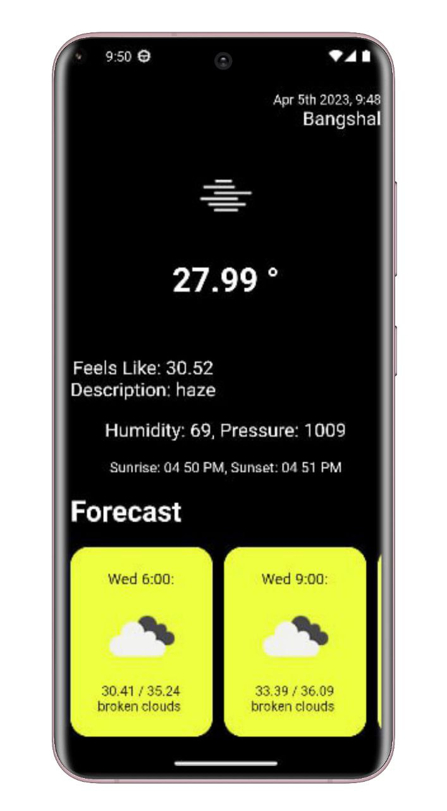

# Weather App

This app gives us weather updates based on the current location and forecast weather. Also, have city Search functionality.

## Screenshots

<p align="center">
  
</p>


## Features

- Easy to use
- Live previews
- Fullscreen mode
- Cross platform


## Setup

Clone the repository

```bash
  git clone https://github.com/Tofazzal-2443/weather_app.git
```
Move to the desired folder

```bash
  cd \weather_app
```
To run the app, simply write

```bash
  flutter pub get
```
```bash
  flutter run
```
## Tech Stack

**Built With:** Dart, Flutter


## Platform

- Android


## Support

For support, please contact here [](https://www.linkedin.com/in/tofazzal15/)
